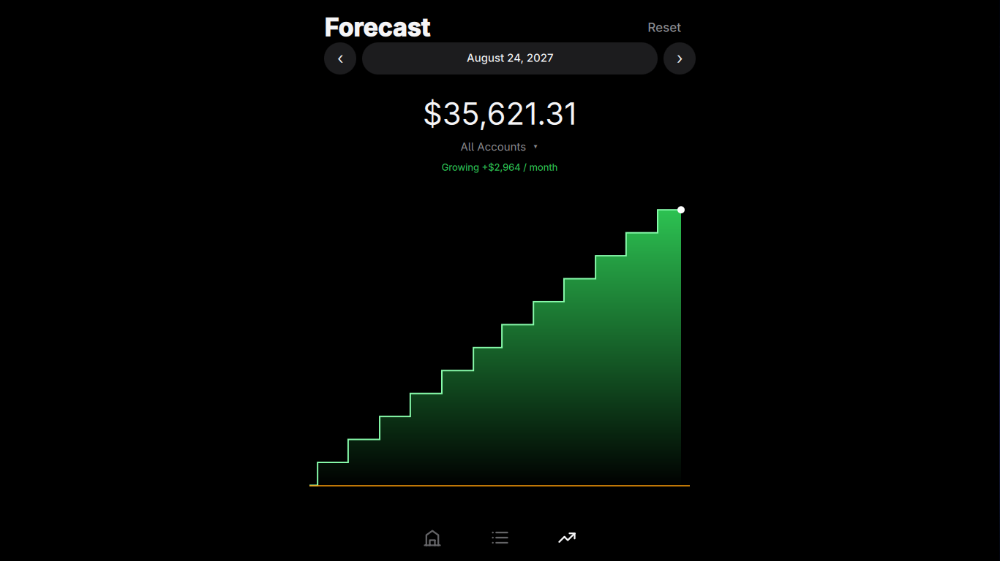

# Runway



A checking-account forecast for Omarchy: accounts, a plan of incomes / transfers / expenses, and a green step-chart of cash from today to any date you pick.

Click the staircase icon in the bar to open it. Escape dismisses. Data lives in `~/.config/omarchy/runway-v3.json`. Accounts start empty.

## Install

```bash
omarchy plugin add https://github.com/maiosx/runway.git --enable --yes
```

For a local checkout:

```bash
plugin_dir="$HOME/.config/omarchy/plugins/runway.forecast"
mkdir -p "$(dirname "$plugin_dir")"
ln -s "$PWD" "$plugin_dir"
omarchy-shell shell rescanPlugins
omarchy plugin enable runway.forecast
```

The plugin targets Omarchy Quattro and uses only Qt Quick and Quickshell components already present in Omarchy. It does not install packages, modify Hyprland configuration, or run background executables.

## Notes

- The overlay is a `WlrLayer.Overlay` surface with exclusive keyboard focus.
- `keepLoaded: true` keeps the forecast in memory between opens.
- Disable or remove with:

```bash
omarchy plugin disable runway.forecast
omarchy plugin remove runway.forecast --yes
```
